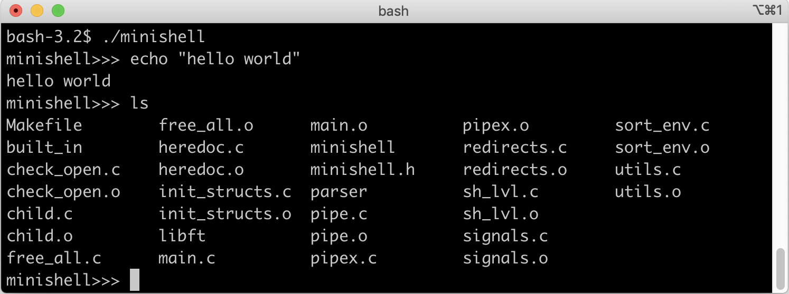

## Учебный проект в "Школе 21" - делаем свой мини-bash

Функционал: 

+ Поиск и запуск нужного исполняемого файла (на основе переменной PATH, а также по относительному или абсолютного пути).
+ Встроенные команды:
  + echo
  + cd
  + pwd
  + export
  + unset
  + env
  + exit
+ Обработка пайпов и редиректов
+ Обработка одинарных и двойных кавычек
+ Подстановка переменных окружения 
+ Коды выхода аналогично bash
+ Сигналы Ctrl-C, Ctrl-D, Ctrl-\

Скомпилировать: `make`

Запустить: `./minishell`

